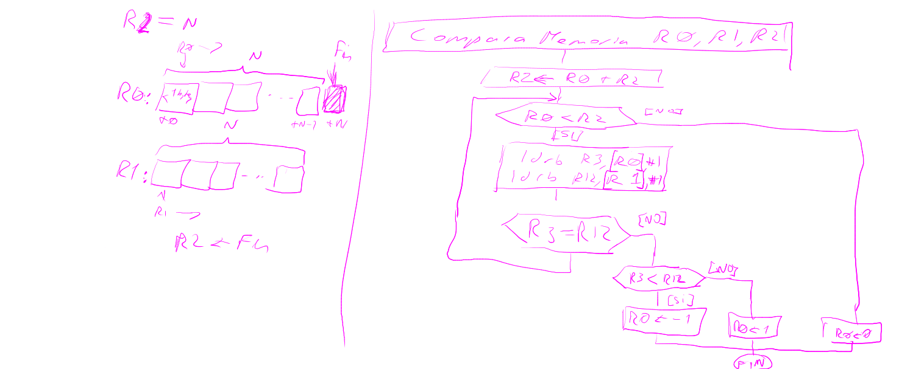
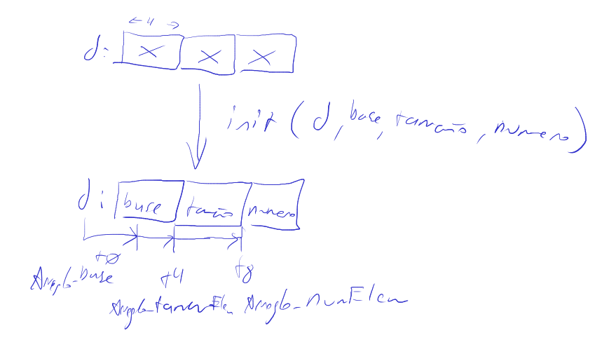
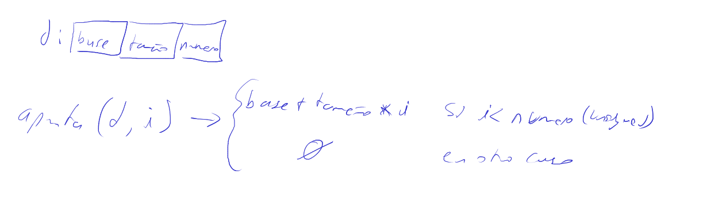
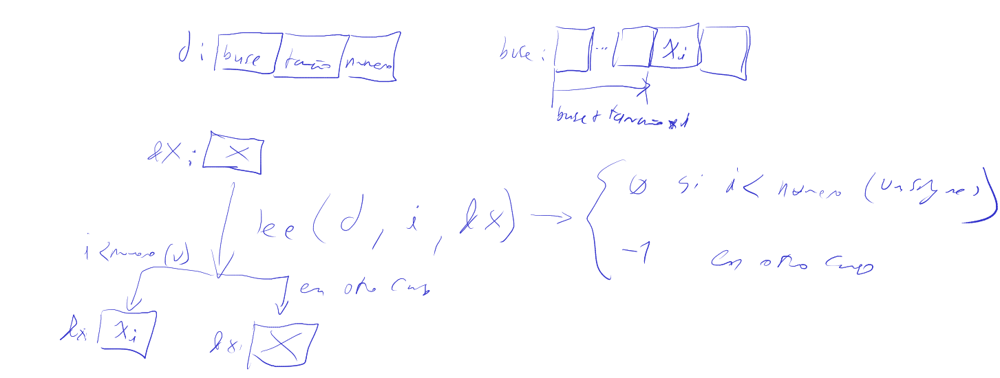
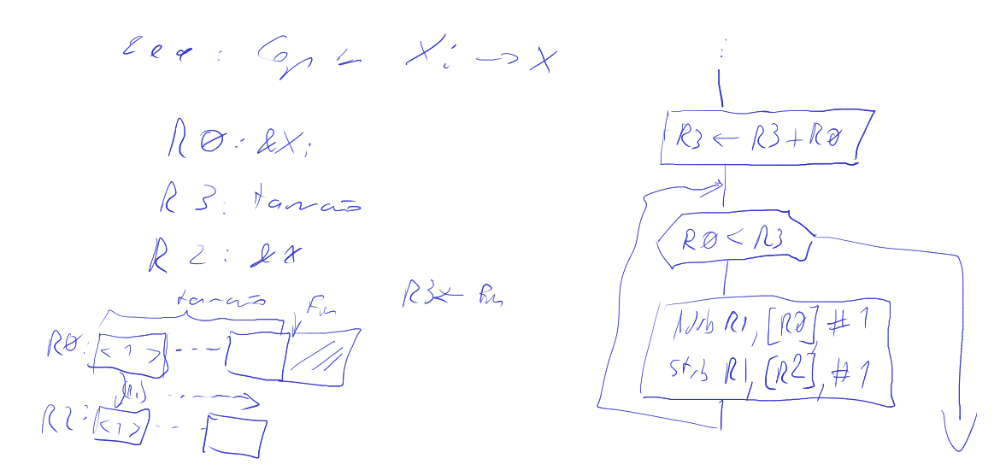
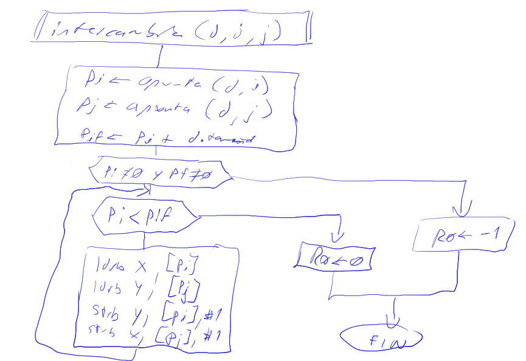

# Memoria técnica - Estructuras de datos en ensamblador de un procesador ARMv7M

Electrónica IV - TP - Estructuras de datos en ensamblador de un procesador ARMv7M

> Aquí tu nombre completo

## Objetivos

> Aquí explica de forma resumida de que se trata el práctico y lista los
> ejercicios que vas a desarrollar.
>

## Compara regiones de memoria

Dadas dos regiones de memoria de igual tamaño, que llamaremos *izquierda* y
*derecha*, compara sus contenidos byte a byte como valores *sin signo* y retorna
un valor entero. El valor retornado será $0$ si los contenidos de las regiones
son *iguales*, $-1$ si el primer byte distinto es *menor* en *izquierda* que en
*derecha* y $1$ si el primer byte distinto es *mayor* en *izquierda* que en
*derecha*. Tu solución será en la forma de la función `comparaMemoria` cuyo uso
se ejemplifica en el Listado 2. Ubica tu solución en `lib/ops_memoria/compara.S`

Listado 2:

```c
#include <stdint.h>
#include "serie.h"

#include "ops_memoria.h"

/* Prototipo en ops_memoria.h
int comparaMemoria(const void *izquierda,const void *derecha, size_t tamano);
*/

uint8_t a1[]={0,1,2,3};
uint8_t a2[]={0,1,3,5};
uint8_t a3[]={0,1,2,3};
size_t tamano = 4;

void listado_2(void){
    const int comp1 = comparaMemoria(a1,a3,tamano);
    const int comp2 = comparaMemoria(a1,a2,tamano);
    const int comp3 = comparaMemoria(a2,a3,tamano);
    Serie_enviaEntero(comp1); // envia "0"
    Serie_enviaNuevaLinea();
    Serie_enviaEntero(comp2); // envia "-1"
    Serie_enviaNuevaLinea();
    Serie_enviaEntero(comp3); // envia "1"
    Serie_enviaNuevaLinea();
}
```

### Análisis del problema



### Solución

```asm
comparaMemoria: // R0: base region izq., R1 : base region der., R2: nro. de bytes
    add r2,r0
0:
    cmp r0,r2
    bhs 3f
    ldrb r3,[r0],#1
    ldrb r12,[r1],#1
    cmp r3,r12
    beq 0b
    bge 2f
    mov r0,#-1
1:
    bx lr
2:
    mov r0,#1
    b 1b
3:
    mov r0,#0
    b 1b
```

## Arreglo

En este problema nos ocuparemos de representar un arreglo mediante un tipo de
datos estructurado o registro (struct de lenguaje C) que contiene la información
necesaria para operar sobre el mismo. El elemento que describe al arreglo se
llamará *descriptor*. Definiremos funciones que implementan una interfaz
uniforme de acceso al arreglo en base a un descriptor. Dicha interfaz contiene
las siguientes operaciones:

- Inicializar un descriptor de arreglo
- Obtener un puntero a un elemento del arreglo
- Leer un elemento del arreglo
- Escribir un elemento del arreglo
- Intercambiar los valores de dos elementos del arreglo

Encabezados y tipo de dato descriptor en C

```c
typedef struct Arreglo{ //  El descriptor de arreglo:
    void *base;             //  Desplazamiento +0, 4 bytes
    int32_t tamanoElemento; //  Desplazamiento +4, 4 bytes
    int32_t numElementos;   //  Desplazamiento +8, 4 bytes
}Arreglo;

/**
 * @brief Inicializa un descriptor que describe un arreglo con una direccion de
 * memoria base, tamaño de elemento y número de elementos dados
 * 
 * @param descriptor Puntero al descriptor a inicializar 
 * @param base Dirección base del arreglo
 * @param tamanoElemento Tamaño del elemento
 * @param numElementos Número de elementos
 */
void Arreglo_init(Arreglo *descriptor, void *base,
                  int tamanoElemento, int numElementos);

/**
 * @brief Retorna un puntero a un elemento del arreglo descrito
 * 
 * @param descriptor Descriptor de arreglo inicializado con Arreglo_init
 * @param indice
 * @return void* Puntero al elemento indicado por indice, NULL si no existe el
 * elemento (NULL es la dirección 0)
 */
void *Arreglo_apunta(Arreglo *descriptor, int indice);

/**
 * @brief Lee el valor de un elemento del arreglo descrito, copiándolo en el
 * espacio de memoria proporcionado. Supone que la región de memoria tiene
 * tamaño suficiente
 * 
 * @param descriptor Descriptor del arreglo
 * @param indice Índice del elemento a leer
 * @param destino Puntero a la regió de memoria donde copiar el valor
 * @return int 0 si la operación pudo realizarse, -1 si el elemento no existe
 */
int Arreglo_lee(const Arreglo *descriptor, int indice, void *destino);

/**
 * @brief Escribe el valor proporcionado en el arreglo descrito
 * 
 * @param descriptor Descriptor de arreglo
 * @param indice Índice del elemento a escribir
 * @param origen Puntero a región conteniendo los datos a escribir
 * @return int 0 si efectuó la operación, -1 si no existe el elemento en el
 * arreglo
 */
int Arreglo_escribe(Arreglo *descriptor, int indice, const void *origen);

/**
 * @brief Intercambia los valores de dos elementos del arreglo
 * 
 * @param descriptor Descriptor de arreglo
 * @param indice_1 Primer índice
 * @param indice_2 Segundo índice
 * @return int 0 si tuvo exito, -1 si algún elemento no existe
 */
int Arreglo_intercambia(Arreglo *descriptor, int indice_1, int indice_2);
```

### Análisis del problema






*Arreglo_escribe* es similar a *Arreglo_lee* pero lee de la dirección en R2 y escribe en la dirección en R0.



### Solución

La solución está en el listado de ensamblador `lib/arreglo/arreglo.S`


> A partir de aquí documentarás para cada ejercicio tu proceso de diseño, lo que
> será de utilidad para razonar sobre como llegaste a un resultado, por qué
> se cometieron errores (en caso que haya ocurrido) y como podrías mejorarlo
> para llegar a buenos resultados de forma más eficiente. Si bien el contenido
> del trabajo irá evolucionando, es importante que cuando encuentres un problema
> o te "trabes" durante el proceso, escribas una nota.  
> *Sugiero conservar estas instrucciones durante el desarrollo, posiblemente
> en forma impresa, para poder referirte a ellas como guía mientras trabajas*
>
> ## Nombre del ejercicio
>
> Explica el objetivo del programa, sus entradas y salidas esperadas. Da
> ejemplos ilustrativos
>
> ***IMPORTANTE***: El proceso de diseño es *iterativo*, por lo tanto los
> sub-capítulos siguientes no se escribirán en orden sino que, tras una primera
> versión irán siendo actualizados conforme avance tu conocimiento del problema
> y tome forma tu solción. *Cada vez que encuentras una dificultad añade una
> nota en el sub-capítulo correspondiente*.
>
> ### Análisis del problema
>
> Desarrolla aquí tu análisis del problema, puedes por ejemplo, resolver
> "a mano" de casos particulares ilustrativos para entender mejor como trabajar.
> En esta sección vas desarrollando un algoritmo para resolver el problema.
>
> ### Solución
>
> Presenta aquí la versión final del algoritmo junto con su implementación en
> ensamblador.
>
> ### Notas
>
> Incluye aquí notas describiendo tu experiencia en la solución del ejercicio.
> En casos simples puede que no tengas nada que añadir y en esos casos puedes
> omoitirlo. Debe figurar aquí una nota por cada problema o dificultad que te
> sorprendió o causó que te "trabes", busques ayuda o dediques más de 5' de
> razonamiento a entender como y por qué ocurre algo distinto a lo esperado.
>
> ### Referencias
>
> Incluye aquí referencias a los recursos que utilizaste durante tu proceso de
> diseño, las mismas deben haber sido *citadas* en estilo *APA* en el punto
> del desarrollo donde las utilizaste.
> *NOTA* Es prácticamente imposible que hayas completado un ejercicio sin
> necesidad de consultar ninguna referencia (libro, video, ejemplo en internet,
> etc.) y es importante que las incluyas aquí en el momento mismo que las
> consultes. Si una referencia resulto guiarte de forma erronea, inclúyela y
> citala en la correspondiente nota que explique lo ocurrido.
>
